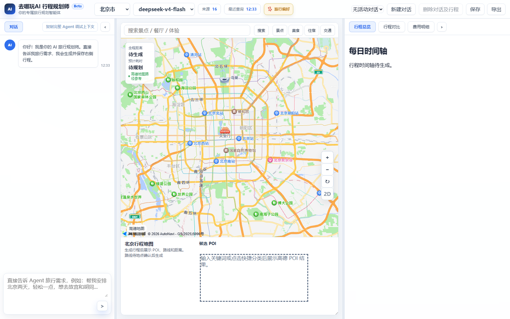
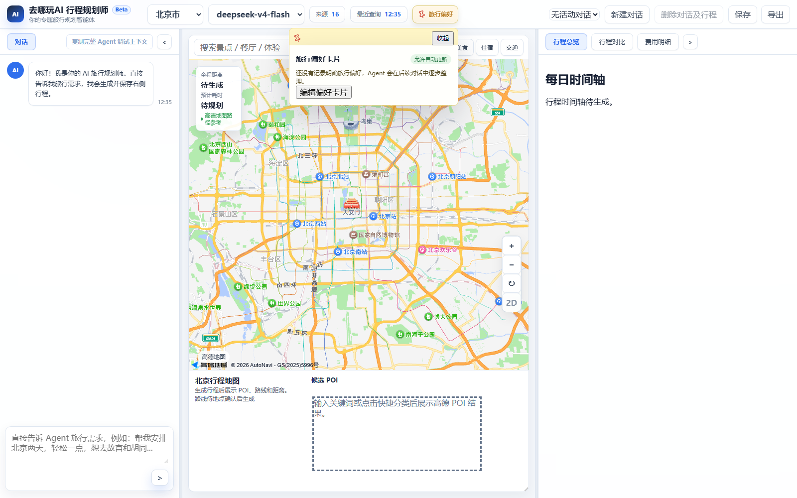
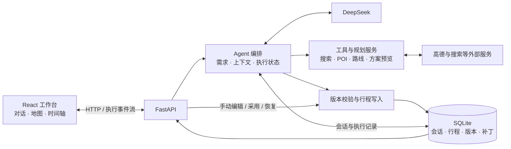

<div align="center">

# Trip · AI 旅行规划工作台

**把旅行想法变成可查看、可编辑、可继续调整的行程。**

对话规划 · 地图联动 · 每日时间轴 · 版本恢复


[](LICENSE)

[界面预览](#preview) · [功能](#features) · [快速开始](#quick-start) · [配置](#configuration) · [架构](#architecture) · [文档](#documentation) · [许可证](#license)

</div>

Trip 是面向中文旅行场景的**本地单用户 Web Demo**。用户通过对话表达目的地、时间、节奏和偏好，在同一个工作台查看地图与每日安排，再通过对话或手动编辑持续调整。后端结合 DeepSeek、地图与搜索工具处理规划，并用 SQLite 保存会话和行程版本。

**作者：[Mario-yc](https://github.com/Mario-yc)。本项目公开源码，允许署名后非商业使用；企业内部业务、收费部署、广告、引流及付费课程等商业用途须另行取得书面授权。** 完整条件见 [LICENSE](LICENSE) 和 [中文说明](docs/LICENSE.zh-CN.md)。

> 项目仍在迭代。方案预览、待补草稿和已保存行程是不同状态；工具证据不足时会保留待确认或失败信息。仓库中的离线测试与截图不构成真实服务全流程通过的证明。

<a id="preview"></a>
## 界面预览

### 一个工作台，连接对话、地图与行程



*2026-09-06 实拍，前端基于已提交版本 `e617177`，使用独立本地数据库。此图展示初始化界面与布局，不是成功生成完整行程的样例。*

### 让旅行偏好保持可见、可修改



*2026-09-06 实拍，前端基于已提交版本 `e617177`。偏好卡片可查看和编辑后续规划参考的旅行偏好。*

<a id="features"></a>
## 能做什么

| 能力 | 用户可以做什么 | 当前范围 |
| --- | --- | --- |
| 对话规划 | 描述需求、补充限制、继续修改行程 | 依赖模型与外部工具；需要时先澄清或返回待补状态 |
| 地图与地点 | 搜索地点、查看候选、确认位置，联动时间轴 | 接入高德 POI 与路线；歧义候选需要确认 |
| 每日时间轴 | 查看每天安排，修改时间、地点与路线选项 | 保存通过后端版本校验，页面以服务器结果更新 |
| 旅行偏好 | 查看和编辑偏好卡片，让后续对话参考偏好 | 本地 Demo 的偏好记录，不等同于完整个人画像 |
| 会话与版本 | 新建、切换、删除会话；编辑历史消息；恢复版本 | 历史改写会回到对应状态并重新生成，影响后续对话 |
| 执行过程 | 查看规划步骤、工具调用、来源与失败原因 | 流式传递执行事件；不是逐字输出模型内部推理 |
| 行程导出 | 导出 Markdown 或 JSON，留存或继续处理 | 行程文件导出已实现；另有开发用 Trace 与运行工件 |
| 攻略参考 | 搜索攻略、查看来源，基于可读取原文继续规划 | 原文可能被登录、验证或 HTTP 错误阻断 |

多方向比较与 Creative Portfolio 用于探索不同旅行方案；是否进入对应路径取决于配置和当前会话状态。尚未采用的预览不会自动成为正式行程；已保存的部分草稿仍会显示未完成的安排。

<a id="quick-start"></a>
## 快速开始

以下以 **Windows + PowerShell** 为例，命令从仓库根目录执行。其他系统可分别启动前后端，但根目录的一键启动脚本面向 Windows。

### 1. 准备环境

| 依赖 | 要求 |
| --- | --- |
| Python | 后端声明为 3.9+；新环境建议使用 3.11 |
| Node.js | 支持 20.x 的 20.19+、22.x 的 22.13+ 或 24+；新环境建议 22.x 的 22.13+ |
| uv | 用于创建 Python 虚拟环境和安装后端依赖 |
| Git、npm | 获取代码及安装前端锁定依赖 |
| 外部服务 | 对话规划需要 DeepSeek；地图、地点与路线需要对应高德配置 |

```powershell
git clone https://github.com/Mario-yc/Trip-public.git
cd Trip-public

# 已有 trip 虚拟环境时跳过创建
if (-not (Test-Path -LiteralPath .\trip\Scripts\python.exe)) {
    uv venv --python 3.11 trip
}
uv pip install --python .\trip\Scripts\python.exe -e "backend[dev]"

Push-Location frontend
npm ci
Pop-Location
```

依赖定义分别见 [后端依赖](backend/pyproject.toml) 和 [前端依赖](frontend/package.json)。可选的 `backend[search]` 提供 DDGS 依赖，需要 Python 3.10+；基础安装无需先启用它。

### 2. 创建本地配置

```powershell
# 保留已有本地配置，不覆盖凭据或个人设置
if (-not (Test-Path -LiteralPath backend/.env)) {
    Copy-Item -LiteralPath backend/.env.example -Destination backend/.env
}
if (-not (Test-Path -LiteralPath frontend/.env)) {
    Copy-Item -LiteralPath frontend/.env.example -Destination frontend/.env
}
```

编辑 `backend/.env`，至少填写下方“核心配置”中的模型与地图参数。前端默认连接 `http://localhost:8000/api`；修改后端端口时，一键启动脚本会同步前端 API 地址与后端允许的前端来源。

### 3. 启动前后端

```powershell
.\start-dev.ps1
```

脚本会检查端口并打开两个服务终端。访问 [工作台](http://localhost:5173)，后端接口文档位于 [API Docs](http://localhost:8000/docs)。停止服务可在对应终端按 `Ctrl+C`。

默认端口为后端 `8000`、前端 `5173`。如有占用，选择空闲端口：

```powershell
.\start-dev.ps1 -BackendPort 8001 -FrontendPort 5174
```

<details>
<summary>分别启动服务</summary>

在仓库根目录的第一个终端启动后端：

```powershell
.\trip\Scripts\python.exe -m uvicorn src.main:app --app-dir backend --host localhost --port 8000 --reload
```

在第二个终端启动前端：

```powershell
cd frontend
npm run dev -- --host localhost --port 5173 --strictPort
```

手动使用不同端口时，需要一起调整 `FRONTEND_ORIGIN` 和 `VITE_API_BASE_URL`。所有后端命令均使用仓库内 `trip` 虚拟环境。

</details>

<a id="configuration"></a>
## 配置说明

### 核心配置

完整模板见 [backend/.env.example](backend/.env.example) 与 [frontend/.env.example](frontend/.env.example)。凭据仅写入本地 `.env`，不要提交到仓库。

| 变量 | 所在文件 | 用途 |
| --- | --- | --- |
| `DEEPSEEK_API_KEY` | `backend/.env` | 调用 DeepSeek Agent 的服务端凭据 |
| `DEEPSEEK_MODEL` | `backend/.env` | 选择账户实际可用的模型；由配置决定 |
| `MAP_PROVIDER_KEY` | `backend/.env` | 高德 Web 服务 Key，用于地点、路线等后端调用 |
| `MAP_JS_API_KEY` | `backend/.env` | 高德 JavaScript API Key，用于浏览器地图 |
| `MAP_PROVIDER_SECURITY_JS_CODE` | `backend/.env` | 浏览器地图对应的安全密钥配置 |
| `DATABASE_URL` | `backend/.env` | SQLite 位置，模板默认为 `sqlite:///./trip_demo.db` |
| `FRONTEND_ORIGIN` | `backend/.env` | 允许访问后端的前端来源 |
| `VITE_API_BASE_URL` | `frontend/.env` | 前端调用的后端 API 地址 |

模板中的 `DEEPSEEK_MODEL=deepseek-v4-flash` 是配置示例，不代表你的账户必然具备该模型权限。请使用账户实际可用的模型，并在 [Provider 状态接口](http://localhost:8000/api/providers/status) 检查配置与运行提示；“已配置”仍需真实请求验证。

缺少 `DEEPSEEK_API_KEY` 时，普通 Agent 对话会报告服务不可用。`PROVIDER_MODE=mock` 不会自动让缺少凭据的真实 Agent 规划成功；测试夹具或 CLI 的显式模拟模式也不能证明模型、地点和路线已真实调用。

### 可选能力与开发开关

| 配置 | 模板默认值 | 说明 |
| --- | --- | --- |
| `AGENT_INITIAL_PLANNING_MODE` | `strict_portfolio` | 服务端初始规划模式；`simple_open_v1` 为显式启用的开发实验路径 |
| `AGENT_CREATIVE_PORTFOLIO_ENABLED` | `false` | Creative Portfolio 可选开关，不应从分支名推断它已开启 |
| `WEB_SEARCH_PROVIDER_MODE` | `chain` | 搜索服务按配置链调用，失败与降级信息会保留 |
| `WEB_SEARCH_PROVIDER_CHAIN` | 见后端模板 | 可按可用服务配置；部分供应商或配额需要独立凭据 |

初始规划模式与 Portfolio 开关含义不同；需要测试特定路径时，应同时核对模式、开关和返回状态。搜索选项详见 [搜索 Provider 链说明](docs/web_search_provider_chain.md)。

<a id="usage"></a>
## 开始一次规划

1. **描述旅行。** 输入目的地、日期或天数、人数、交通方式与偏好，例如：“北京两天，两个人，公共交通，节奏轻松，想逛胡同和看夜景。”
2. **补齐关键条件。** 回答澄清问题，检查偏好卡片；有多个候选地点或方案时，从当前页面提供的选项继续。
3. **查看规划状态。** 区分方案预览、待补安排与已保存行程，并核对地点、路线和来源提示。
4. **继续调整。** 通过对话提出“第二天下午少走一点”，或直接编辑时间轴；保存后以页面返回的版本为准。
5. **留存结果。** 导出 Markdown / JSON，或从版本记录恢复需要的行程状态。

规划结果取决于条件完整度、模型返回、地点覆盖和路线服务。示例输入仅说明交互方式，不承诺每次都能一次生成完整方案。

<a id="architecture"></a>
## 架构与数据流

前端使用 React 18、TypeScript 与 Vite；后端使用 Python、FastAPI 与 Pydantic 2，数据保存到 SQLite。

前端负责交互，后端负责规划、验证和持久化。规划过程可以查询工具、准备候选与预览；行程变更统一进入受版本保护的写入服务，避免旧页面或重复操作覆盖当前结果。



[查看可编辑架构图](docs/readme/architecture.drawio)

三个关键约束：

- **写入有版本。** 修改行程需携带 `baseVersionId`，由后端判断是否仍然有效，再保存补丁与新版本。
- **候选有状态。** 地点候选、待补槽位、方案预览与正式行程分别处理；缺失证据不会自动变成已验证地点。
- **失败可追踪。** 工具事件、验证结果与运行记录保留失败信息；外部调用失败时不能用虚构地点或路线补成成功。

### 仓库入口

| 路径 | 作用 |
| --- | --- |
| [`frontend/src/components/`](frontend/src/components/) | 工作台、地图、时间轴、偏好与对话组件 |
| [`frontend/src/state/`](frontend/src/state/) | 当前会话、行程状态、上下文与版本保护 |
| [`backend/src/api/`](backend/src/api/) | API 路由与 Pydantic 请求/响应契约 |
| [`backend/src/services/`](backend/src/services/) | Agent、规划、地图、路线、验证和版本写入服务 |
| [`backend/src/core/`](backend/src/core/) | 环境配置、SQLite 连接与 schema |
| [`backend/tests/`](backend/tests/) / [`frontend/tests/integration/`](frontend/tests/integration/) | 后端测试与前端交互回归 |
| [`backend/evals/`](backend/evals/) | 离线 Agent 评测、Trace 回放与检查工具 |

<a id="validation"></a>
## 开发与验证

安装开发依赖后，可在仓库根目录运行统一检查：

```powershell
.\scripts\verify.ps1
```

也可按改动范围分别运行：

```powershell
# 仓库根目录：后端与 Agent 离线评测
.\trip\Scripts\python.exe -m pytest backend/tests
.\trip\Scripts\python.exe -m ruff check backend/src backend/tests
.\trip\Scripts\python.exe backend/evals/run_offline.py

# 前端：交互测试、构建与静态检查
Push-Location frontend
npm test
npm run build
npm run lint
npm run format:check
Pop-Location
```

自动化测试中存在模拟 Provider 与确定性夹具，离线评测主要验证契约和回归。真实验收应另行记录：当前代码版本、实际模型与地图调用、浏览器操作、SQLite 保存与恢复结果，以及未通过或未执行的环节。

### 不打开前端的调用方式

后端提供 CLI，可供脚本创建会话、发送请求、导出运行工件和回放已有结果。例如检查运行环境：

```powershell
.\trip\Scripts\python.exe -m src.cli.agent_cli health --json
```

完整用法见 [AI Runtime CLI](docs/ai-runtime-cli.md) 与 [运行工件说明](docs/ai-run-artifacts.md)。接口与行为以当前源码和实际运行结果为准。

<a id="documentation"></a>
## 文档导航

| 想了解什么 | 阅读入口 |
| --- | --- |
| 公开文档总入口 | [文档导航](docs/README.md) |
| 产品目标与 MVP 范围 | [MVP PRD](specs/001-ai-travel-planner/mvp-prd.md)、[原始需求](AI旅行规划Agent需求说明.md) |
| 功能规格与接口契约 | [Feature Spec](specs/001-ai-travel-planner/spec.md)、[API Contract](specs/001-ai-travel-planner/contracts/api-contract.md) |
| 搜索服务接入 | [Web Search Provider Chain](docs/web_search_provider_chain.md) |
| 署名、使用范围与商业授权 | [许可证中文说明](docs/LICENSE.zh-CN.md) |
| Agent 自动化与可回放证据 | [CLI](docs/ai-runtime-cli.md)、[运行工件](docs/ai-run-artifacts.md) |
| 开发贡献与文档约定 | [贡献指南](CONTRIBUTING.md) |

产品规格说明设计目标，不能作为所有功能已实现或真实服务已验收的证明。公开文档按使用、开发和规格组织；当前能力与限制以本页及实际运行结果为准。

## 当前边界

- **使用场景：** 当前是本地单用户 Demo，未提供生产级账户体系、多租户隔离与线上部署承诺。
- **地点和行程：** 支持真实高德地点与路线核验，也允许明确标识的待补或草稿状态；不能把所有可见条目都视为已经高德验证。
- **天气与票务：** 高德天气受供应商日期窗口限制；票务提供信息线索与来源提示，不包含订票支付。提醒发送默认走模拟通道。
- **攻略原文：** 部分站点无法读取正文。读取失败时会保留失败或待处理状态；不保证任意攻略链接都可读取或完成后续规划。
- **外部成本：** 模型、地图和搜索的账号权限、配额、费用与网络可用性由对应服务决定。

## 参与开发

问题反馈与代码贡献请阅读 [CONTRIBUTING.md](CONTRIBUTING.md)。请提供复现步骤、预期与实际结果及脱敏错误信息，勿提交密钥、真实用户数据库、上传原件、运行缓存或个人 AI 工作记录。

<a id="license"></a>
## 署名与许可证

本项目采用自定义的 **Trip Attribution NonCommercial License 1.0**。
它是附带非商业限制的源码公开许可，不是 OSI 认可的开源许可证。

- **允许：** 遵守许可证的个人使用、学习、非商业研究、修改、Fork 和非商业分发。
- **必须：** 保留 `LICENSE`、`NOTICE` 与版权声明；分发文档及面向用户的应用按照许可证注明 **Mario-yc** 和原项目链接；标明自己的修改。
- **须另行书面授权：** 企业内部业务、软件销售、收费网站/API、代搭建、付费定制与维护、广告、商业引流、付费课程及其他直接或间接商业利用。没有实际盈利也可能属于商业用途。

完整条款见 [LICENSE](LICENSE)，中文解释见 [许可证说明](docs/LICENSE.zh-CN.md)，署名文本见 [NOTICE](NOTICE)。商业授权可通过 [作者主页](https://github.com/Mario-yc) 联系；未回复不表示授权。第三方依赖与外部内容仍按各自许可和服务条款使用。

## README 参考

本页的信息组织参考了 [Dify](https://github.com/langgenius/dify/blob/main/README.md)、[Flowise](https://github.com/FlowiseAI/Flowise/blob/main/README.md) 与 [AutoGen](https://github.com/microsoft/autogen/blob/main/README.md) 的项目介绍、快速开始和文档导航方式。参考不表示技术依赖、合作关系或功能对等；相关项目的维护状态以其官方仓库为准。
